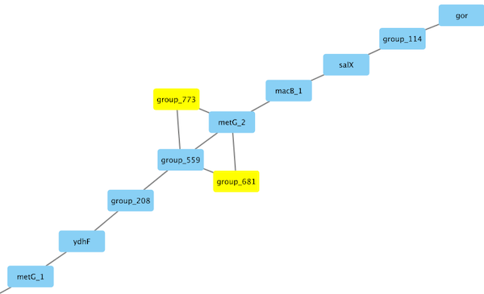

# Inspecting the genome graph neighbourhood of a gene of interest
Looking at the genome graph in Cytoscape we can easily identify region in the genome graph that suggest some structural variation such as here:



We have colored nodes/genes in the graph that are supported by all samples in blue and genes that are supported by fewer samples in yellow. From this representation we cannot draw any conclusions about which paths through the genome graph are supported by which samples and/or how many different paths through that region of variation are there altogether. Here, we can use `panaroo-gene-neighbourhood`, which will find all the paths that run through one particular node in the graph. 

```
panaroo-gene-neighbourhood --gene metG_2 --graph final_graph.gml --out neighbourhood.txt
```

Looking at the output in `neighbourhood.txt` we can see that their are three unique paths through these nodes. The dominant one excludes genes 'group_774' and 'group_681'. 

NOTE: the direction of each path is not guaranteed.

```
support members                                 path
46      14410_4#2,14410_6#47,14520_4#27,...     cpnA,metG_1,ydhF,group_208,group_559,metG_2,macB_1,salX,group_114,gor,bioY2
3       14520_7#67,15531_4#68,15531_4#73        bioY2,gor,group_114,salX,macB_1,metG_2,group_681,group_559,group_208,ydhF,metG_1
1       19646_1#31                              bioY2,gor,group_114,salX,macB_1,metG_2,group_773,group_559,group_208,ydhF,metG_1
```

By default for each sample this will explore the five genes downstream and upstream from the target gene. We can add `--expand_no EXPAND NO` to change this behavior. For example running the same example as

```
panaroo-gene-neighbourhood --gene metG_2 --graph final_graph.gml --out neighbourhood.txt --expand_no 2
```

gives

```
support members                                 path
46      14410_4#2,14410_6#47,14520_4#27,...     group_208,group_559,metG_2,macB_1,salX
3       14520_7#67,15531_4#68,15531_4#73        salX,macB_1,metG_2,group_681,group_559
1       19646_1#31                              salX,macB_1,metG_2,group_773,group_559
```


When we are interested in the exact paths through the graph it is sometime useful to turn off the edge filtering that Panaroo performs. This will allow us to see edges even if they look like they could be the result of misassemblies. This can be done by running Panaroo as

```
panaroo -i *.gff -o output_panaroo/ --clean-mode strict -t 24 --no_clean_edges
```

### Parameters

```
usage: panaroo-gene-neighbourhood [-h] --gene GENE [--genome_id GENOME_ID]
                                  --graph GRAPH [--expand_no EXPAND_NO]
                                  [--out OUT]

Explore gene neighbourhood

optional arguments:
  -h, --help            show this help message and exit
  --gene GENE           gene of interest
  --genome_id GENOME_ID
                        genome ID of interest (default=ALL)
  --graph GRAPH         genome graph gml ('final_graph.gml')
  --expand_no EXPAND_NO
                        lengths of the path that will be expanded on in a
                        radius the target gene (default=5)
  --out OUT             output file
```