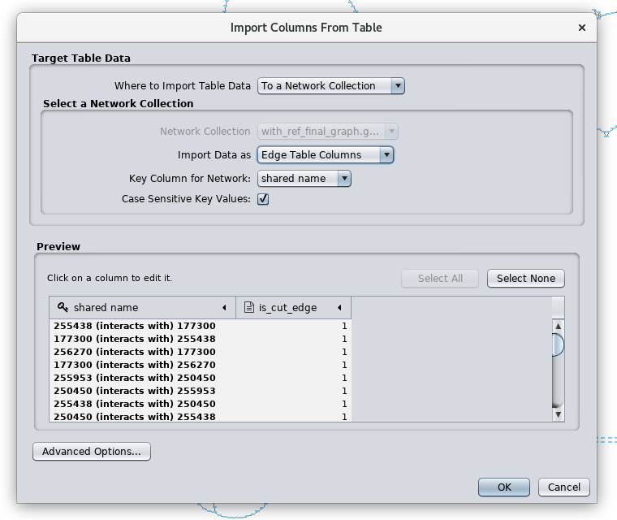
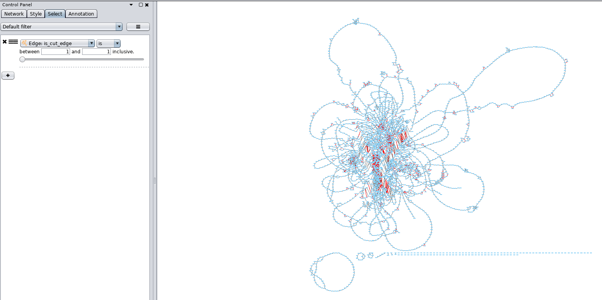
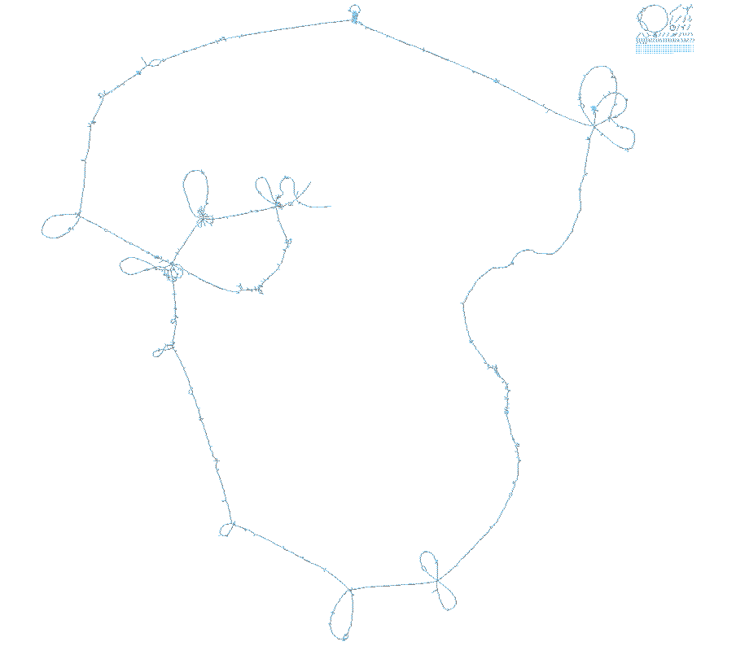
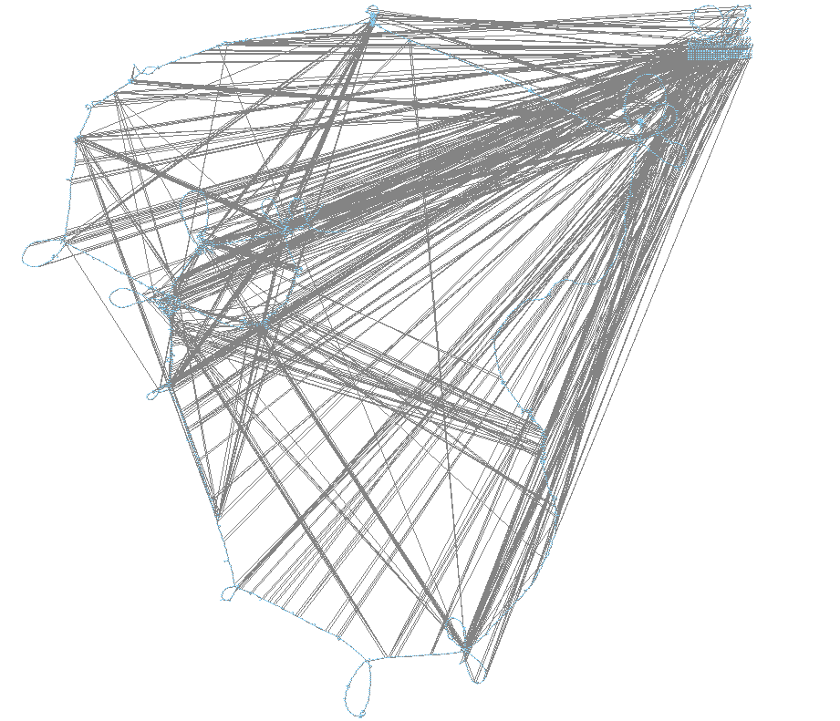

# Using a reference genome to produce less convoluted layouts
The standard organic layout algorithm in Cytoscape is very effective at laying out very big networks but still produces some times very convoluted networks. 

If we include a completely sequenced genome such as most reference genomes we can use this as a backbone for a simpler layout. Specifially, we identify paths through the genome graph that connect regions in the reference genome that are far apart on the chromosome. We call them long-range connetions. We have implemented an algorithm based on a minimum capacity graph-cut to identify any such path and finally a set of edges that disconnects those long-range connections in the genome graph.
`python ~/repos/panaroo/scripts/reference_based_layout.py  0 final_graph.gml  capacity_cut_edges.txt --add_reference_edges`

As input this requires the id of the reference genome in the Panaroo input and the graph. Since Panaroo sometimes removes links between consecutive genes in the reference genome, we currently advise to run this script with the `--add_reference_edges`  flag.  The script will generate a version of the genome graph `final_graph_with_ref.gml` that is guarantueed to keep all connection in the reference genome. As main output of the layout script we get a table with all edges that break up long-range connection `capacity_cut_edges.txt`. Next we need to import these edges into Cytoscape: 

 Make sure that you select "Import Data as: Edge Table columns"
 Next in the Control Panel go to Select and a filter for Edge: is_cut_edge.  I will highlight all edges that we have just imported.
 
Then hide all those edges:

Finally apply the yFiles organic layout to re-lay out the genome graph

The resulting layout:

We can click on Show All Nodes and Edges to make all long-range connections re-appear.
